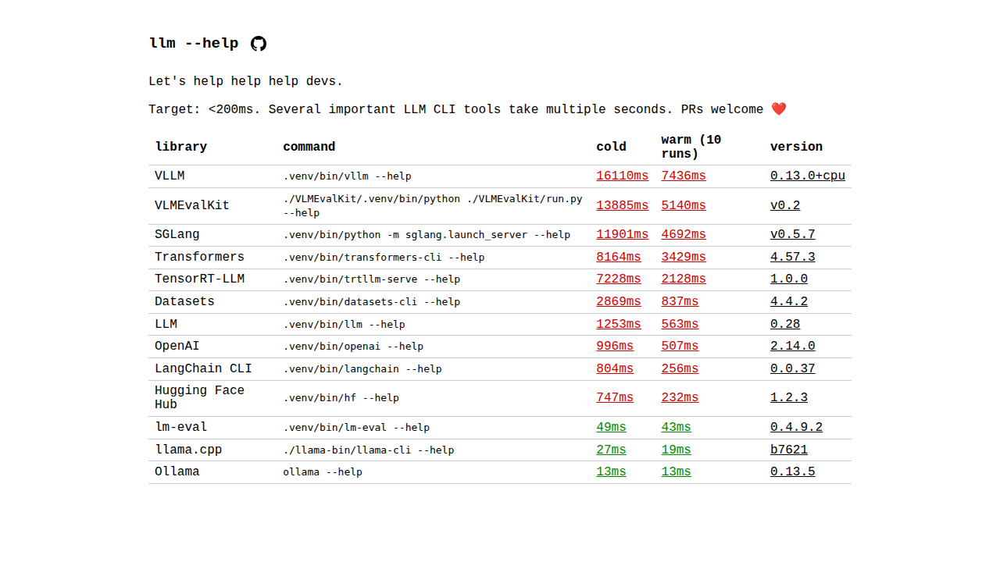

# dash-dash-help

Let's help help help devs.

`--help` should take <200ms. Most LLM CLI tools take 10+ seconds because they import torch/transformers just to print usage text.

https://dashdashhelp.win

